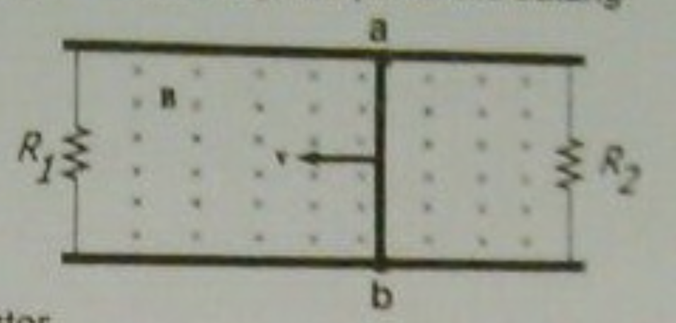
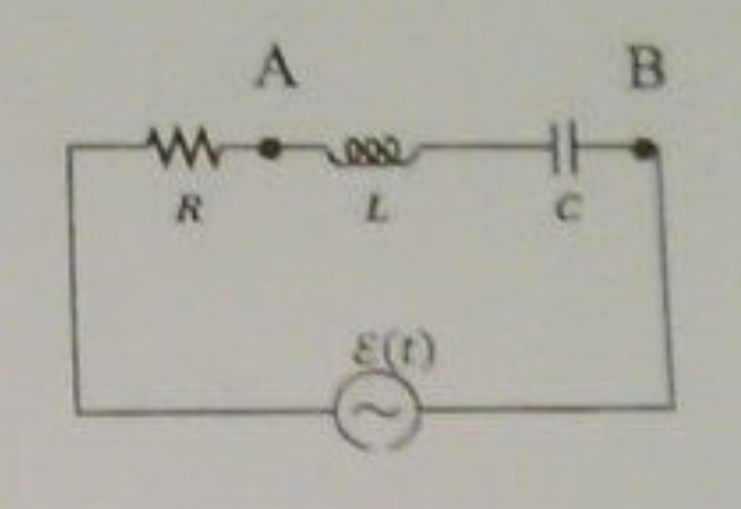
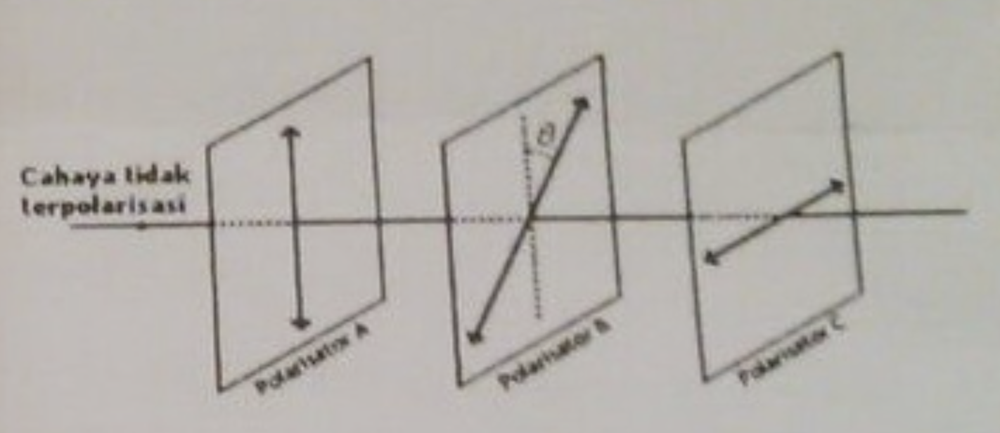
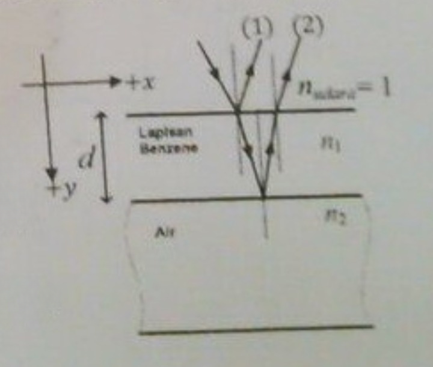

## 1
Sebuah batang konduktor ab memiliki panjang $l = 0.35$ m dapat dengan bebas bergerak pada dua batang konduktor lainnya, dimana pada ujung kedua batang tersebut dihubungkan masing-masing dua buah resistor $R_1 = 2 \Omega$ dan $R_2 = 5 \Omega$ (lihat gambar). Diketahui medan magnetik serba sama yang besarnya $B = 2,5$ T dan diarahkan tegak lurus masuk ke bidang gambar. Sebuah gaya luar menarik batang konduktor ke arah kiri sehingga batang bergerak dengan laju konstan $v = 8$ m/s. Tentukanlah:  
  
a) besar dan arah arus induksi yang melewati masing-masing resistor.  
b) daya total yang terdisipasi (terbuang) pada kedua resistor.  
c) besarnya gaya luar yang dikenakan pada batang konduktor.

## 2
Tegangan sumber AC pada suatu rangkaian seri RLC ($R = 80 \Omega$, $L = 100$ mH dan $C = 25 \mu$F) dinyatakan dengan $\varepsilon(t) = 0,8\sin \left(400t + \frac{\pi}{2} \right)$ V, dengan $t$ dalam sekon. Tentukanlah:  
  
a) impedansi rangkaian  
b) arus pada rangkaian sebagai fungsi waktu  
c) beda potensial antara titik A dan B ($V_{AB}$ *rms*)  
d) daya *rms* dari sumber pada rangkaian  

## 3
Tiga buah polarisator A, B, dan C dipasangkan secara berurutan dan sejajar satu sama lain. Polarisator A berorientasi vertikal, polarisator B berorientasi $\theta$ terhadap vertikal, dan polarisator C berorientasi horizontal seperti ditunjukkan pada gambar disamping. Seberkas cahaya yang tidak terpolarisasi dengan intensitas $I_0$ datang menuju sistem polarisator tersebut.  
  
a) Tentukan intensitas cahaya yang keluar dari polarisator C sebagai fungsi dari $\theta$  
b) Tentukan nilai $\theta$ agar intensitas cahaya yang keluar dari polarisator $C$ bernilai maksimum  
c) Jika polarisator B diputar dengan kecepatan sudut $\omega$ konstan terhadap sumbu yang tegak lurus bidang polarisator, tentukan intensitas cahaya yang keluar dari polarisator C sebagai fungsi dari waktu ($t$). Diketahui $\theta = 0$ saat $t = 0$

## 4
Seberkas cahaya dengan panjang gelombang $600$ nm datang pada selaput tipis yang terdiri dari *benzene*, dengan indeks bias $n_1 = 1,5$ yang berada di atas air dengan indeks bias $n_2 = 1,3$ dengan sudut datang sangat kecil. Jika gelombang datang direpresentasikan dengan fungsi gelombang: $\psi = A \sin(ky - \omega t + \phi)$, dengan $y$ dalam meter dan $t$ dalam sekon. (Pilih sumbu koordinat dimana arah $y$ positif sesuai gambar)  
  
a) Tuliskan fungsi gelombang pantulan pertama (1) dan kedua (2)  
b) Tentukan ketebalan (d) lapisan *benzena* agar total gelombang pertama (1) dan kedua (2) menghasilkan interferensi minimum (destruktif)

## 5
Sebuah foton yang datang sejajar sumbu $x$ dan mempunyai energi $300$ keV, menumbuk sebuah elektron yang diam. Setelah tumbukan tersebut, foton terhambur sehingga energinya berkurang $20%$.  
a) Berapa sudut hamburan foton terhadap sumbu $x$ setelah tumbukan?  
b) Berapa nilai pergeseran Compton akibat tumbukan tersebut (selisih beda panjang gelombang foton sebelum dan setelah tumbukan)?  
c) Tentukan nilai panjang gelombang foton sebelum dan setelah tumbukan?
