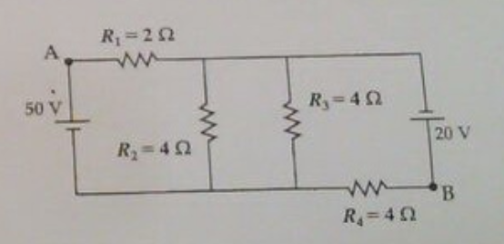

## 1
Di dalam sebuah ruang dua dimensi terdapat dua muatan titik $Q_A = 6 \times 10^{-6}$ C dan $Q_B = -3 \times 10^{-6}$ C. Muatan $Q_A$ berada di pusat koordinat sedangkan muatan $Q_B$ berada di suatu titik yang belum diketahui. Untuk mengetahuio posisi $Q_B$ seorang pengamat menggeser-geser sebuah muatan uji $Q$ di setiap titik di dalam ruang tersebut. Teramati oleh mengamat bahwa muatan $Q$ tidak mengalami gaya Coulomb ketika berada di titik $(x, y) = (3, 4)$ meter.  
a) Tentukanlah medan listrik di titik $(1,2)$ meter yang ditimbulkan muatan $Q_A$.  
b) Dengan menuliskan posisi muatan $Q_B$ sebagai $\vec{r_B} = x\hat{i} + y\hat{j}$, tuliskan ungkapan gaya Coulomb total yang bekerja pada muatan uji $Q$ ketika berada di titik $(3,4)$.  
c) Tentukanlah posisi muatan $Q_B$.

## 2
Sebuah bola konduktor berjari-jari $a$ memiliki muatan total $-3Q$. Sebuah bola isolator berongga dengan tebal kulit $c - b$ melingkupi bola konduktor tersebut dengan titik pusat saling berhimpitan. Jari-jari bagian dalam isolator adalah $b > a$, dan jari-jari luarnya adalah $c > b$. Isolator memiliki muatan total $+2Qn$ kerapatan muatan dinyatakan sebagai $\rho(r) = \frac{\beta}{2\pi r}$, dengan $\beta = 2Q/(c^2 - b^2)$.  
a) Tentukanlah vektor medan listirk $\vec{E}$ di $r < a$, $a < r < b$, dan $b < r < c$.  
b) Gambarkan sketsa kurva besar medan listrik $E$ dari $r = 0$ sampai $r = b$.  
c) Tentukan besar beda potensial antara titik $r = c$ dan $r = b$.

## 3
Suatu kapasitor dengan kapasitansi $4,4$ pF dihubungkan dengan baterai $12$ V. Pada keadaan tunak, medan listrik antar pelat $E = 5,8 \times 10^{4}$ V/m. Jika baterai dilepas, kemudian sebuah bahan dielektrik dengan konstanta dielektrik $\kappa = 4,8$ disisipkan ke dalam kapasitor sehingga celah kapasitor semua terisi bahan dielektrik, tentukanlah nilai besaran-besaran berikut setelah kapasitor terisi bahan dielektrik:  
a) beda potensial kapasitor, medan listrik pada daerah antarpelat, dan kapasitansi,  
b) energi listrik yang tersimpan dalam kapasitor.  
c) Jika kemudian baterai dipasang kembali, tentukan nilai keempat besaran pada pernyataan a-b setelah keadaan tunak tercapai

## 4
Pada rangkaian seperti di samping, tentukanlah:  
  
a) nilai $I_1$, $I_2$, $I_3$, $I_4$ yang berturut-turut menyatakan arus yang mengalir pada hambatan $R_1$, $R_2$, $R_3$, $R_4$,  
b) daya disipasi pada hambatan $R_3$,  
c) beda potensial antara titik A dan B.

## 5
Sebuah elektron $(q = -1,6 \times 10^{-19}, m = 9,11 \times 10^{-31} kg)$ bergerak sepanjang sumbu $x$ dengan kecepatan $\vec{v} = 8 \times 10^6 \hat{i}$ (m/s). Elektron tersebut kemudian memasuki ruang $x > 0$ yang dipengaruhi medan magnet $\vec{B} = 5 \times 10^{-3} \hat{j}$ (T) sehingga mengalami gaya magnet.  
a) Tentukan vektor gaya magnet yang dialami oleh elektron sesaat setelah memasuki ruang $x > 0$.  
b) Beberapa waktu kemudian elektron terluar dari ruang bermedan magnet di titik P. Tentukan vektor posisi dan vektor kecepatan elektron di titik P.  
c) Jika diinginkan elektron tetap bergerak lurus sepanjang sumbu $x$, tentukan vektor medan listrik yang harus diberikan pada ruang $x > 0$.