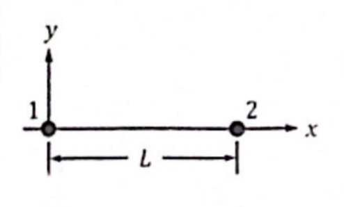
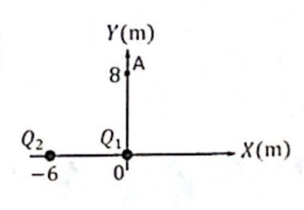
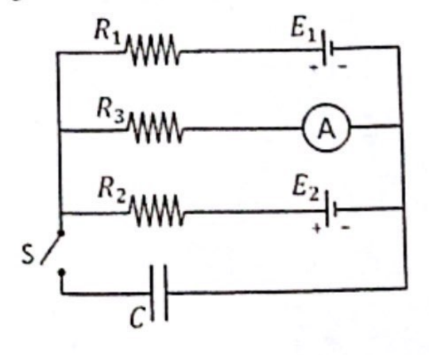
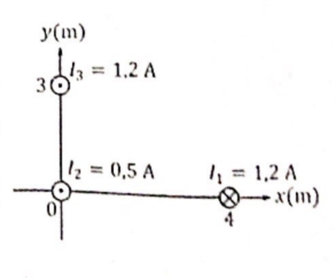

## 1
Di dalam ruang terdapat partikel $1$ bermuatan $+q$, partikel $2$ bemuatan $+4,00q$, dan partikel $3$ bermuatan $q_3$. Setiap partikel berada dalam keadaan setimbang sehingga diam di tempatnya masing-masing. Posisi partikel $1$ dan partikel $2$ ditunjufkkan gambar di samping, dengan $L = 9,00$cm, Tentukan  

a) vektor medan listrik di titik $(x, y)=$ $(9$ cm, $12$ cm$)$ oleh partikel $1$,  
b) koordinat posisi partikel $3$,  
c) rasio $q_3/q$.

## 2
Sebuah bole isolator berjari-jari $R$ memiliki rapat muatan konstan $\rho$. Tinjau sebuah permukaan tertutup berbentuk silinder dengan panjang $L$ dan jari-jari $r_0$ dengan $L \gt 2R$ dan $r_0 \gt R$.  
a) Tentukan muatan total dari bole tersebut,  
b) Tentukanlah fluks medan listrik pada permukaan tertutup tersebut jika titik pusat silinder berimpit dengan pusat bola  
c) Jika total fluks medan listrik yang melalui tutup dan alas silinder adalah $\Phi_0$, tentukan fluks medan listrik yang melalui selimut silinder. Nyatakan jawaban Anda dalam $\rho$, $R$, $\varepsilon_0$, dan $\Phi_0$

## 3
Muatan titik $Q_1 = -2,0 \times 10^{-9}$ C dan $Q_2 = +8,0 \times 10^{-9}$ C menetap di posisinya seperti diperlihatkan pada gambar. Gunakan acuan bahwa $V = 0$ di posisi sangat jauh (tak hingga).  

a) Hitunglah potensial di titik A,  
b) Berapakah usaha yang diperlukan untuk membawa muatan titik $Q_3 = +3,0 \times 10^{-9}$ C dari posisi yang sangat jauh (tak hingga) ke titik A?  
c) Tentukan energi potensial listrik sistem tiga muatan titik ini.

## 4
Perhatikan gambar rangkaian listrik di samping. Diketahui $R_1 = 10\ \Omega$, $R_3 = 3\ \Omega$, $E_1 = 11$ volt, dan $E_2 = 12$ volt.  

a) Jika kapasitor pada rangkaian adalah kapasitor pelat sejajar dengan luas pelat $A = 1,0 \times 10^{-3}$ m$^2$, jarak antar pelat $L = 8,85 \times 10^{-3}$, dan disisipi penuh oleh material dielektrik dengan konstanta dielektrik $k = 4,8$, tentukanlah kapasitansi kapasitor tersebut.  
b) Mula-mula saklar S dalam keadaan terbuka. Jika bacaan amperemeter A menunjukan arus $2,0$ A berapakah nilai hambatan $R_2$?  
c) Kemudian saklar S ditutup. Pada keadaan tunak (setimbang), berapa muatan $Q$ yang tersimpan pada kapasitor?  
d) Setelah mencapai keadaan tunak, kapasitor kemudian dilepas dan selanjutnya dihubungkan ke sebuah resistor dengan hambatan $R = 2,0\ \Omega$ sehingga membentuk sebuah rangkaian tertutup. Tentukan waktu yang dibutuhkan sampai muatan dalam kapasitor berkurang menjadi setengahnya. Diketahui $\ln \left(\frac{1}{2}\right) = -0,7$.

## 5
Sebuah proton yang sedang bergerak dengan kecepatan tetap $\vec{v}$ memasuki daerah bermedan magnet $\vec{V} = (0,5$ tesla$)\hat{k}$ dan bermedan listrik $\vec{E}$ dengan $E = 1670$ N/C. Massa proton $1,67 \times 10^{-27}$ kg dan muatan proton $1,6 \times 10^{-19}$ C.  
a) Jika $\vec{v} = 8(\hat{i} + \hat{j}) \times 10^4$ m/s, tentukanlah vektor gaya magnet yang dialami proton saat proton masuk di dalam daerah bermedan magnet.  
b) Jika proton tidak mengalami perubahan kecepatan dan medan listrik searah sumbu $x$ positif, tentukanlah kecepatan $\vec{v}$.  
c) Jika medan listrik dan kecepatan proton searah medan magnet, tentukanlah percepatan proton ketika berada di dalam daerah bermedan listrik dan magnet.

## 6
Tiga buah kawat lurus sangat panjang dialiri arus $I_1$, $I_2$, $I_3$ seperti tampak pada gambar disaming.  

a) Dengan menggunakan hukum ampere, tentukanlah medan magnet pada sumbu $z$ akibat arus $I_1$.  
b) Tentukanlah gaya persatuan panjang pada kawat berarus $I_2$ oleh kawat berarus $I_1$ dan $I_3$.  
c) Jika terdapat kawat berarus $I_4 = 1$ A memasuki bidang tulis sejajar sumbu $z$, tentukanlah posisi kawat tersebut pada bidang $xy$ agar resultan gaya per satuan panjang pada kawat berarus $I_2$ bernilai $0$.
