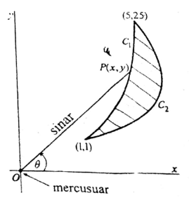

## Bagian A

### 1
Hitung $\displaystyle \int (\tan x + \sec x)^2\ dx$

### 2
Hitung $\displaystyle \int \frac{dx}{x^2 - 4}$

### 3
Hitung $\displaystyle \lim_{x \rightarrow 0} \frac{1-\sec x}{x^2}$

### 4
Hitung $\displaystyle \int_{1}^{2} \frac{1}{(x - 1)^{3/4}}\ dx$

### 5
Selidiki kekonvergenan deret $\displaystyle \sum_{n = 1}^{\infty} \frac{n2^n}{3^n}$

### 6
Tentukan kemiringan/gradien garis singgung dari kurva
$\displaystyle \begin{cases}
x = t + e^t \\
y = t^2 + e^t
\end{cases}$ di titik $(1,1)$

### 7
Tentukan jari-jari kekonvergenan deret $\displaystyle \sum_{n = 1}^{\infty} \frac{(x - 1)^n}{n2^n}$

## Bagian B

### 1
a) Hitung $\displaystyle \int t^2e^t\ dt$.  
b) Hitung $\displaystyle \lim_{t \rightarrow -\infty} e^t(t^2-2t+2)$.  
c) Selidiki kekonvergenan integral tak wajar $\displaystyle \int_{-\infty}^{0} t^2e^t\ dt$.  

### 2
Diberikan fungsi $f(x) = \sin(x - 0,1)$.  
a) Tentukan $P_3(x)$, polinom Taylor derajat tiga di sekitar $a = 0,1$.  
b) Tentukan nilai hampiran dari $\sin(0,2)$ dengan menggunakan $P_3(x)$.  
c) Tentukan batas galat (error) dari jawaban b  

### 3
Pada gambari disamping, daerah yang diarsir adalah sebuah pula dibatasi oleh kurva $C_1$ dan $C_2$. Kurva $C_1$ adalah parabola $y = x^2,\ \ 1 \le x \le 5$. Pada titik $O(0,0)$ terdapat mercusuar yang berputar dengan laju satu putaran per menit. Misalkan $P(x,y)$ adalah titik pada pantai $C_1$ yang terkena sinar mercusuar dan $\theta$ sudut antara $\overrightarrow{OP}$ dan sumbu $x$ positif.  
  
a) Tentukan rentang nilai $\theta$ agar mercusuar menyinari sepanjang pantai $C_1$.  
b) Buktikan bahwa posisi titik $P$ adalah $(\tan \theta, \tan^2 \theta)$.  
c) Tentukan kecepatan gerak titik $P$ sepanjang kurva $C_1$ di titik $(1,1)$.  