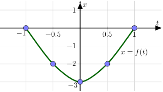

## Bagian A

### 1
Tentukan $$\int \frac{4}{x^2 - 4}\ dx$$.

### 2
Tentukan apakah deret $$\sum_{n = 1}^{\infty} (-1)^{n + 1} \frac{1}{n^3 + 1}$$ konvergen bersyarat, konvergen mutlak atau divegen. Jelaskan jawaban Anda.

### 3
Tentukan jari-jari kekonvergenan deret pangkat $$\sum_{n = 1}^{\infty} \frac{n}{(n + 1)!}x^n$$.

### 4
Tentukan suatu vektor *satuan* yang tegak lurus dengan vektor $\bold{u} = \langle 0,1,-2 \rangle$ dan $\bold{v} = \langle 4,-3,0 \rangle$.

### 5
Jika $f$ fungsi dengan turunan kedua kontinu dan memenuhi $f(1) = 2$, $f(4) = 10$, $f'(1) = 7$, $f'(4) = 3$, hitung nilai $$\int_{1}^{4} xf''(x)\ dx$$

### 6
Misalkan $C$ adalah kurva dengan persamaan parameter $x = f(t)$ dan $y = g(t)$. Grafik $x$ terhadap $t$ dan $y$ terhadap $t$ untuk $-1 \le t \le 1$ diberikan pada gambar di bawah.  
   
Tentukan koordinat titik di kurva $C$ saat $t = -1, \frac{1}{2}, 0, \frac{1}{2}, 1$. Kemudian sketsa kurva tersebut beserta orientasinya.

### 7
Tentukan kekonvergenan deret $$\sum_{n = 1}^{\infty} \frac{\sin^2 n}{n\sqrt{n}+1}$$.

## Bagian B

### 1
a) Tentukan uraian deret Maclaurin (deret pangkat) untuk $-1 \lt x \lt 1$ dari 

$$$
f(x) = \frac{1}{1 + x}
$$$

b) Menggunakan bagian (a), tentukan uraian deret pangkat dari $\ln(1 + x)$.  
c) Dengan memanfaatkan deret yang diperoleh pada bagian (b), tentukan nilai $\ln 3$ dalam bentuk deret.  
(Perhatikan bahwa $x = 2$ berada di luar daerah kekonvergenan deret di (b))

### 2
Diketahui $$f(x) = \frac{e^{2x}-e^x}{e^{2x}-1}$$ untuk setiap $x \neq 0$.  
a) Hitung $$\lim_{x \rightarrow 0} f(x)$$ jika ada.  
b) Hitung $$\lim_{x \rightarrow \infty} f(x)$$ jika ada.  
c) Tentukan $$\int f(x)\ dx$$.  
d) Tentukan kekonvergenan $$\int_{1}^{\infty} f(x)\ dx$$.  

### 3
Vektor posisi $\bold{r}(t)$ ($t$ dalam detik) suatu benda yang dilempar ke udara akan memenuhi persamaan gerak 

$$$
r''(t) = \langle 0,0,-g \rangle
$$$

dengan $g = 10$ meter/detik$^2$ adalah konstanta gravitasi.  
a) Jika vektor kecepatan awal benda adalah $\bold{v}(0) = \langle v_1, v_2, v_3 \rangle$ dan vektor posisi awal benda adalah $\bold{r}(0) = \langle r_1, r_ 2, r_3 \rangle$, tentukan vektor posisi benda tersebut setiap saat.  
b) Sebuah bola dilemparkan dengan kecepatan awal $\langle 2,2,15 \rangle$ dari posisi $\langle 1,0,0 \rangle$. Tentukan tinggi maksimum dari bola tersebut.  
c) Bola kedua dilemparkan $1$ detik kemudian dari posisi $\langle 0,0,1 \rangle$. Tentukan vektor kecepatan awal bola kedua agar mengenai bola pertama (pada soal (b)) satu detik setelah bola kedua dilemparkan.  

